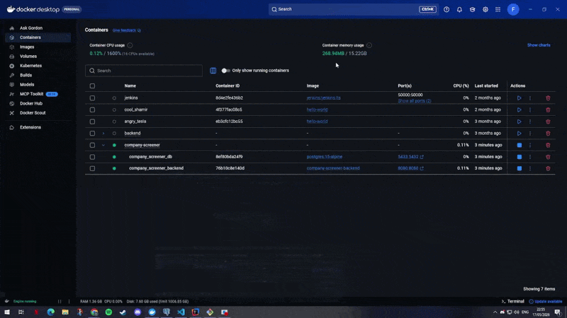

# Company Screener — Nomow Internship Technical Challenge

A full-stack web application where users can browse companies, view their details, and ask AI-powered questions about them. Developed as part of a 48-hour technical challenge for the Nomow internship.

---

## Table of Contents

- [Tech Stack](#tech-stack)
- [Project Structure](#project-structure)
- [How to Run](#how-to-run)
  - [Option A — Docker](#option-a--docker-backend--database)
  - [Option B — Manual](#option-b--manual-setup)
- [API Reference](#api-reference)
- [Features](#features)
- [Technical Choices](#technical-choices)
- [What I'd Improve](#what-id-improve-with-more-time)
- [Incomplete Parts](#incomplete-parts)
- [AI Tools Used](#ai-tools-used)

---

## Tech Stack

| Layer    | Technology                                          |
|----------|-----------------------------------------------------|
| Backend  | Spring Boot 3.5, Java 17, Spring Data JPA           |
| Database | PostgreSQL 15                                       |
| Frontend | Angular 18, Standalone Components, Signals          |
| AI       | Groq API — Llama 3.1-8b-instant (free tier)                  |
| Charts   | Chart.js                                            |
| DevOps   | Docker, Docker Compose                              |

---

## Project Structure

```
company-screener/
├── backend/
│   ├── Dockerfile
│   ├── pom.xml
│   └── src/
│       └── main/
│           ├── java/com/nomow/company_screener/
│           │   ├── controller/
│           │   │   └── CompanyController.java       # REST endpoints
│           │   ├── service/
│           │   │   ├── CompanyService.java          # Business logic
│           │   │   └── AiService.java               # Groq API integration
│           │   ├── repository/
│           │   │   └── CompanyRepository.java       # Spring Data JPA
│           │   ├── entity/
│           │   │   └── Company.java                 # JPA entity
│           │   └── exception/
│           │       ├── CompanyNotFoundException.java
│           │       ├── AiServiceException.java
│           │       └── GlobalExceptionHandler.java  # @RestControllerAdvice
│           └── resources/
│               ├── application.properties           # Config (not committed)
│               ├── application.properties.example   # Safe template
│               └── data.sql                         # 8 seed companies
├── frontend/
│   └── src/
│       └── app/
│           ├── components/
│           │   ├── company-list/      # Home page — cards, search, filter
│           │   ├── company-detail/    # Detail view + AI question box
│           │   ├── sector-chart/      # Bar chart by sector
│           │   └── watchlist/         # Saved companies panel
│           ├── services/
│           │   ├── company.service.ts
│           │   └── watchlist.service.ts
│           ├── models/
│           │   └── company.model.ts
│           ├── app.routes.ts
│           └── app.config.ts
├── docker-compose.yml
└── README.md
```

---

## How to Run

### Option A — Docker (backend + database)

> Requires Docker Desktop installed and running.
> This runs PostgreSQL and the Spring Boot backend together.
> The Angular frontend is always run separately.

**1. Set your Groq API key in `docker-compose.yml`:**

```yaml
environment:
  GROQ_API_KEY: your_groq_api_key_here
```

Get a free key at https://console.groq.com

**2. Start backend + database:**

```bash
docker-compose up --build
```

First build takes 2–3 minutes. Subsequent builds are faster.

**3. Start the frontend:**

```bash
cd frontend
npm install
ng serve
```

**4. Open the app:**

```
http://localhost:4200
```

Backend API available at `http://localhost:8080/api/companies`

**Useful Docker commands:**

```bash
docker-compose down          # stop containers
docker-compose down -v       # stop and wipe the database volume
docker-compose logs backend  # view backend logs
```

---

### Option B — Manual Setup

#### Prerequisites

| Tool | Version |
|------|---------|
| Java | 17+     |
| Maven | 3.8+   |
| PostgreSQL | 15+ |
| Node.js | 20+  |
| Angular CLI | 18+ |

Install Angular CLI globally if you don't have it:

```bash
npm install -g @angular/cli
```

---

#### 1. Database

Create the database in PostgreSQL (via pgAdmin or psql):

```sql
CREATE DATABASE company_screener;
```

---

#### 2. Backend configuration

Copy the example properties file and fill in your values:

```bash
cp backend/src/main/resources/application.properties.example \
   backend/src/main/resources/application.properties
```

Edit `application.properties`:

```properties
spring.datasource.username=postgres
spring.datasource.password=YOUR_POSTGRES_PASSWORD
groq.api.key=YOUR_GROQ_API_KEY
```

Get a free Groq API key at https://console.groq.com

---

#### 3. Run the backend

```bash
cd backend
mvn spring-boot:run
```

The API starts at `http://localhost:8080`.
The database table is created and seeded with 8 companies automatically on first run.

Verify it works:

```bash
curl http://localhost:8080/api/companies
```

---

#### 4. Run the frontend

```bash
cd frontend
npm install
ng serve
```

Open `http://localhost:4200` in your browser.

---

## API Reference

| Method | Endpoint                  | Status | Description                            |
|--------|---------------------------|--------|----------------------------------------|
| GET    | `/api/companies`          | 200    | Returns all companies                  |
| GET    | `/api/companies/{id}`     | 200    | Returns one company by ID              |
| GET    | `/api/companies/{id}`     | 404    | Company not found                      |
| POST   | `/api/companies/{id}/ask` | 200    | Sends question to AI, returns answer   |
| POST   | `/api/companies/{id}/ask` | 503    | AI service unavailable                 |

### Request — AI question

```json
POST /api/companies/1/ask
Content-Type: application/json

{
  "question": "What does this company do?"
}
```

### Response — AI answer

```json
{
  "answer": "Company description generated by Llama 3 via Groq API..."
}
```

### Error response format

All errors return a consistent JSON body:

```json
{
  "timestamp": "2025-05-17T14:23:00",
  "status": 404,
  "error": "Company not found with id: 99"
}
```

---

## Features

### What works

- **Company card grid** — all companies displayed with color-coded sector avatars, name, sector, and country
- **Live search** — filters by name or sector as you type, powered by Angular Signals
- **Sector dropdown** — filter companies by a specific sector
- **Stats bar** — total companies, number of sectors, and number of countries at a glance
- **Detail view** — dedicated route per company showing all fields including founded year and employee count
- **AI question box** — type any question about a company and get an answer from Groq (Llama 3); shows loading state and handles errors
- **Sector bar chart** — visual breakdown of how many companies belong to each sector (Chart.js)
- **Watchlist** — star any company to save it; persisted in localStorage so it survives page refreshes
- **Global error handling** — `@RestControllerAdvice` catches all exceptions and returns clean JSON with correct HTTP status codes
- **Docker Compose** — single command to spin up PostgreSQL and the backend together

---

## Technical Choices

**Groq over Gemini or OpenRouter**
Groq's free tier responds in under a second with Llama 3 8B. The API is OpenAI-compatible, so integration with Spring's `RestClient` is minimal and readable.

**Angular Signals over RxJS for local state**
Signals (`signal()`, `computed()`) are the Angular 18 recommended approach for component-level state. They are simpler to read than BehaviorSubjects for cases like search filtering, loading flags, and AI response state. RxJS is still used where appropriate — HTTP calls through `HttpClient` return Observables.

**Standalone Components**
No NgModules anywhere. Each component declares its own imports, which keeps the architecture flat and makes each file self-documenting.

**Spring `RestClient`**
The modern synchronous HTTP client introduced in Spring 6. No extra dependencies needed compared to WebClient, and simpler than RestTemplate for straightforward API calls.

**`@RestControllerAdvice` for error handling**
Centralises all exception handling in one place. `CompanyNotFoundException` maps to 404, `AiServiceException` maps to 503, and a generic fallback catches anything unexpected. The frontend receives consistent error shapes it can display cleanly.

**`localStorage` for the watchlist**
Simple, zero-backend-cost persistence that survives page refreshes. Sufficient for a prototype. The `WatchlistService` wraps it with Signals so components react automatically when items are added or removed.

**`create-drop` JPA strategy**
The database schema is recreated on every application start and `data.sql` re-seeds the data. This makes the project easy to run from scratch without manual migration steps. In production this would be replaced with Flyway or Liquibase.

---

## What I'd Improve With More Time

- **Pagination** on the company list for larger datasets
- **Flyway migrations** instead of `create-drop` + `data.sql` for a production-ready schema strategy
- **Unit and integration tests** for the service and controller layers (JUnit 5 + MockMvc)
- **Smarter AI prompts** — detect question intent and include only the most relevant company fields in the context rather than always sending everything
- **Skeleton loading screens** instead of plain text loading messages
- **Mobile responsive layout** — the current grid works on desktop but needs breakpoint adjustments for small screens
- **Dedicated watchlist page** rather than a collapsible section at the bottom of the home page
- **CI/CD pipeline** with a simple GitHub Actions workflow to build and test on every push

---

## Incomplete Parts

Nothing from the required spec is missing. All three bonus features (Docker Compose, sector chart, watchlist) are also implemented.

---

## AI Tools Used

**Claude (Anthropic — claude.ai)**
Used as a technical assistant for debugging support, architecture discussion, and documentation refinement. All code was implemented and validated manually.

---

## Demo


